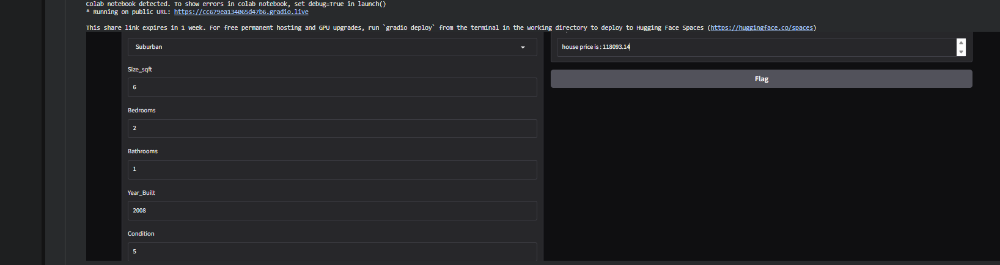

# House Price Prediction

A regression model for estimating residential property prices using physical property attributes and location features.

## Project Structure
- **Code**: `ML_House_Price_Prediction (code).ipynb`
- **Dataset / Resources**: `predicting house price.csv`
- **Documentation**: `README.md`

## Output


## Requirements
```bash
pip install pandas numpy scikit-learn matplotlib seaborn jupyter
```

## Usage
1. Clone the repository:
```bash
git clone https://github.com/Yuossef-Ashraf/ML_House_Price_Prediction.git
cd ML_House_Price_Prediction
```
2. Run the project:
```bash
jupyter notebook "ML_House_Price_Prediction (code).ipynb"
```

## Author
Yuossef Ashraf

## License
MIT License
