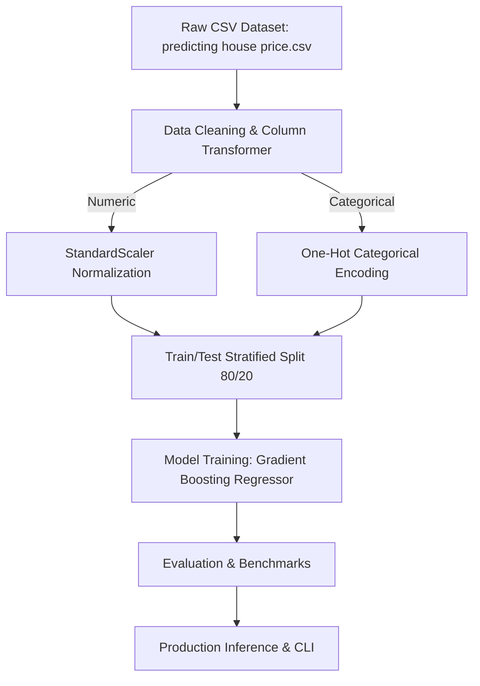

# Residential Real Estate Valuation & Price Prediction - Architecture & Pipeline Design

## Comparative Models Evaluated
- **Gradient Boosting Regressor**
- **Random Forest Regressor**
- **Ridge Regression**
- **XGBoost Regressor**
